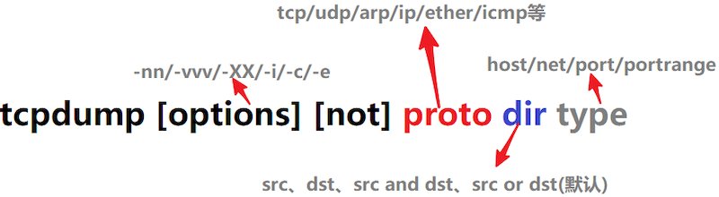

# 抓包分析工具篇

## tcpdump
tcpdump 主要采用命令行工具对网络流量进行筛选抓取，可以灵活的抓取到 tcp udp 等不同端口的进出流量，并可自定义输出。缺点是对抓取的包内容分析不足。

tcpdump 不带任何选项直接运行默认会选取第一个网络接口打印出所有的网络流量包。

### tcpdump 选项
```
Usage: tcpdump [-aAbdDefhHIJKlLnNOpqRStuUvxX] [ -B size ] [ -c count ]
		[ -C file_size ] [ -E algo:secret ] [ -F file ] [ -G seconds ]
		[ -i interface ] [ -j tstamptype ] [ -M secret ]
		[ -P in|out|inout ]
		[ -r file ] [ -s snaplen ] [ -T type ] [ -V file ] [ -w file ]
		[ -W filecount ] [ -y datalinktype ] [ -z command ]
		[ -Z user ] [ expression ]
```
##### 选项释义：
* -i : 选定哪块网卡
* -c : 选定要抓取包的数量
* -nn : 直接显示 ip 地址(不住主机名解析),直接显示端口号（否则显示服务名称） 
* -XX : 输出包的头部信息
* -p ：指定要抓取的包是流入还是流出的包，可选值为 `in`,`out`,`inout`,默认值为`inout`
* -D : 列出可以用来抓包的网卡
* -vv : 准备分析和打印的时候产生详细输出（-vvv 更加详细；-v 更加简易）

##### 表达式[ expression ]：
表达式用于筛选流量包，可以筛选出固定网络协议、具体端口、具体流向、具体的源或者目的网段;每个筛选条件都称之为一个单元，        
tcpdump 的表达式由多个单元组成，每个单元由一个值和该值的修饰符两部分组成，修饰符有三种： `proto`、`dir`、`type`     


1. type:指定 值 的类型，可选类型包括 `host/net/port/portrange`。 例如：“host localhost”、“port 20”、“portrange 6000-8080”
2. dir:指定流入流出方向，可选方向包括 `src/dst/src or dst/src and dst`,默认为 src and dst 。 例如：“src foo ”表示源主机为 foo 的包，“dst net 10.73”表示目的网段在 10.73的数据包，“src or dst port 53”表示源或目的端口为 53 的数据包
3. proto:指定协议，可选项包括不限于`tcp/udp/arp/lcmp等`，默认匹配所有协议。 例如：“tcp port 21”

注：表达式单元之间可以使用操作符 `and/&&/or/||/ not/!` 进行连接


### tcpdump 示例
```
#输出两个 80 端口的头信息 
 tcpdump -c 2 -i eth0 port 80   -nn -XX -vv
# 输出源地址是 weibo_huati112_a5_122 的所有包
 tcpdump src host weibo_huati112_a5_122
#输出 5 个 ping 报文 并打印ip和端口号 
 tcpdump -c 5 -nn -i eth0 icmp
# 输出发往 10.85.14.104 的5个ping报文
 tcpdump -c 5 -i eth0 icmp and dst 10.85.14.104
#输出 2 个22 端口的报文头信息 
 tcpdump -c 2  -XX -nn -i eth0 tcp dst port 22

```


